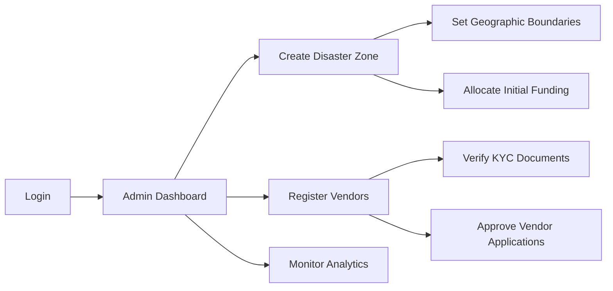
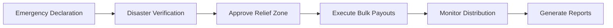
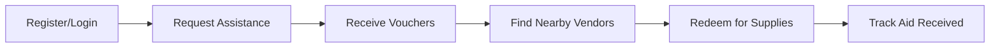
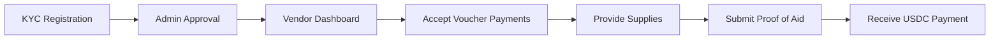
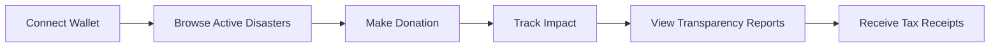

# 🏔️ Avalanche Disaster Relief Network

<div align="center">

[](https://choosealicense.com/licenses/mit/)
[](https://nodejs.org/)
[](https://reactjs.org/)
[](https://docs.avax.network/)
[](https://getfoundry.sh/)

**A revolutionary blockchain-powered disaster relief micro-funding network built on Avalanche**

*Enabling fast, transparent, and fair aid distribution during emergencies*

[🚀 Quick Start](#-quick-start) • [📖 Documentation](#-documentation) • [🎯 Features](#-features) • [🏗️ Architecture](#️-architecture) • [🤝 Contributing](#-contributing)

</div>

---

## 🌟 Overview

The **Avalanche Disaster Relief Network** revolutionizes humanitarian aid by creating a **pre-funded, blockchain-secured relief system** that can deploy aid to disaster victims within hours, not weeks.

### 🚨 The Problem We Solve

Traditional disaster relief faces critical challenges:
- **⏰ Slow Response**: Relief funds take days/weeks to reach victims
- **🔍 Lack of Transparency**: Donors can't track fund usage
- **⚖️ Unfair Distribution**: Aid often distributed equally regardless of impact severity
- **📋 Bureaucratic Delays**: Complex approval processes slow emergency response

### 💡 Our Solution

**Pre-Funded Relief Bonds** + **Instant Blockchain Payouts** + **Role-Based Access Control**

1. **🏦 Pre-Funded Relief Vault**: Corporate ESG bonds and donor contributions create immediately available emergency funds
2. **⚡ Rapid Response**: Oracle-verified disasters trigger automatic fund distribution within hours
3. **🎯 Smart Distribution**: AI-powered impact assessment ensures fair allocation based on actual damage
4. **🔗 Complete Transparency**: Every transaction recorded on Avalanche's immutable ledger
5. **👥 Multi-Stakeholder System**: Seamless coordination between governments, vendors, victims, and donors

---

## 🎯 Key Features

### 🔐 **Role-Based Access Control (RBAC)**
- **👑 Admin**: System configuration and disaster zone management
- **🏛️ Government**: Disaster verification and bulk emergency payouts
- **💰 Treasury**: Yield optimization and fund allocation
- **🔮 Oracle**: Disaster reporting and data verification
- **🏪 Vendor**: Aid distribution and voucher redemption
- **🎯 Victim**: Emergency assistance and voucher management
- **💝 Donor**: Contributions and impact tracking

### ⚡ **Real-Time Blockchain Integration**
- **Smart Contract Automation**: Avalanche-powered transparent fund management
- **USDC Stablecoin**: Price-stable aid distribution
- **Instant Settlements**: Sub-second transaction finality
- **Gas Optimization**: Minimal transaction costs

### 🌐 **Comprehensive Web Platform**
- **📱 Mobile-First Design**: Touch-friendly emergency interfaces
- **🔄 Real-Time Updates**: WebSocket-powered live data
- **🌍 Multi-Language Support**: Accessible during international disasters
- **🔒 Web3 Integration**: MetaMask and wallet connectivity

### 📊 **Advanced Analytics & Reporting**
- **📈 Impact Tracking**: Real-time aid effectiveness measurement
- **🗺️ Geographic Visualization**: Disaster zone mapping and coverage
- **💹 Financial Analytics**: Fund utilization and yield optimization
- **🔍 Fraud Detection**: AI-powered suspicious activity monitoring

---

## 🏗️ Architecture

```
┌─────────────────────────────────────────────────────────────────┐
│                    🌐 Frontend (React + Vite)                   │
│  ┌─────────────┐ ┌─────────────┐ ┌─────────────┐ ┌─────────────┐ │
│  │   Admin     │ │ Government  │ │   Vendor    │ │   Victim    │ │
│  │ Dashboard   │ │   Portal    │ │   Portal    │ │   Portal    │ │
│  └─────────────┘ └─────────────┘ └─────────────┘ └─────────────┘ │
└─────────────────────────────────────────────────────────────────┘
                                │
                                ▼
┌─────────────────────────────────────────────────────────────────┐
│                  🔧 Backend API (Node.js + Express)             │
│  ┌─────────────┐ ┌─────────────┐ ┌─────────────┐ ┌─────────────┐ │
│  │    Auth     │ │ RBAC System │ │   IPFS      │ │  Analytics  │ │
│  │  Service    │ │   Engine    │ │ Integration │ │   Engine    │ │
│  └─────────────┘ └─────────────┘ └─────────────┘ └─────────────┘ │
└─────────────────────────────────────────────────────────────────┘
                                │
                                ▼
┌─────────────────────────────────────────────────────────────────┐
│              📊 Database Layer (PostgreSQL + Redis)             │
│  ┌─────────────┐ ┌─────────────┐ ┌─────────────┐ ┌─────────────┐ │
│  │    Users    │ │  Disasters  │ │  Vendors    │ │ Transactions│ │
│  │   & RBAC    │ │   & Zones   │ │   & KYC     │ │  & Vouchers │ │
│  └─────────────┘ └─────────────┘ └─────────────┘ └─────────────┘ │
└─────────────────────────────────────────────────────────────────┘
                                │
                                ▼
┌─────────────────────────────────────────────────────────────────┐
│            ⛓️ Avalanche Blockchain (Fuji Testnet)               │
│  ┌─────────────┐ ┌─────────────┐ ┌─────────────┐ ┌─────────────┐ │
│  │ Disaster    │ │   Relief    │ │   USDC      │ │  Monitoring │ │
│  │   Relief    │ │   Bonds     │ │   Token     │ │   Service   │ │
│  │   System    │ │     V2      │ │ (Stablecoin)│ │             │ │
│  └─────────────┘ └─────────────┘ └─────────────┘ └─────────────┘ │
└─────────────────────────────────────────────────────────────────┘
```

### 📁 **Project Structure**

```
Avalanche__Team1/
├── 🎨 frontend/                    # React + Vite Application
│   ├── src/
│   │   ├── components/             # Reusable UI components
│   │   │   ├── Admin/              # Admin dashboard components
│   │   │   ├── Auth/               # Authentication components
│   │   │   ├── Charts/             # Data visualization
│   │   │   ├── DisasterRelief/     # Relief-specific components
│   │   │   ├── Layout/             # Navigation & layout
│   │   │   ├── Treasury/           # Financial management
│   │   │   ├── UI/                 # Generic UI components
│   │   │   └── Web3/               # Blockchain integration
│   │   ├── contexts/               # React context providers
│   │   ├── hooks/                  # Custom React hooks
│   │   ├── pages/                  # Route components by role
│   │   │   ├── admin/              # Admin dashboard pages
│   │   │   ├── donor/              # Donor portal pages
│   │   │   ├── vendor/             # Vendor management pages
│   │   │   └── victim/             # Victim assistance pages
│   │   ├── routes/                 # Role-based route groups
│   │   ├── services/               # API & blockchain services
│   │   ├── store/                  # State management (Zustand)
│   │   └── utils/                  # Helper functions
│   └── package.json
│
├── 🔧 backend/                     # Node.js Backend Services
│   ├── api-server/                 # Main REST API Server
│   │   ├── src/
│   │   │   ├── controllers/        # Request handlers
│   │   │   ├── database/           # Database connection & migrations
│   │   │   ├── middleware/         # Auth, validation, RBAC
│   │   │   ├── models/             # Database models (Sequelize)
│   │   │   ├── routes/             # API route definitions
│   │   │   ├── services/           # Business logic services
│   │   │   └── utils/              # Helper functions
│   │   ├── setup-database.js       # Database setup wizard
│   │   ├── server.js               # Main application entry
│   │   └── package.json
│   │
│   ├── monitoring-service/         # Blockchain Event Monitoring
│   │   ├── src/
│   │   │   ├── analyzers/          # Fraud detection & analytics
│   │   │   └── listeners/          # Smart contract event listeners
│   │   ├── monitor.js              # Main monitoring entry
│   │   └── package.json
│   │
│   └── scripts/                    # Development & deployment scripts
│       ├── setup.sh                # Project setup automation
│       ├── dev.sh                  # Development environment
│       └── build.sh                # Production build
│
├── ⛓️ contracts/                   # Solidity Smart Contracts
│   └── disaster-relief-contracts/  # Foundry project
│       ├── src/                    # Smart contract source code
│       │   ├── DisasterReliefSystem.sol       # Main relief operations
│       │   ├── DisasterReliefBondsV2.sol      # Pre-funded relief bonds
│       │   └── MockUSDC.sol                   # Test USDC token
│       ├── script/                 # Deployment scripts
│       ├── test/                   # Contract tests
│       └── foundry.toml            # Foundry configuration
│
├── 📚 docs/                        # Documentation
│   ├── API-KEYS-GUIDE.md           # External service setup
│   ├── AVAX-INTEGRATION-GUIDE.md   # Avalanche integration
│   ├── DEPLOYMENT-PENDING-TASKS.md # Development roadmap
│   ├── PINATA-INTEGRATION-GUIDE.md # IPFS setup guide
│   └── SUPABASE-SETUP.md           # Database setup guide
│
├── 📋 scripts/                     # Automation scripts
│   ├── integration-setup.sh        # Full stack development
│   ├── setup-environment.sh        # Environment configuration
│   ├── stop-services.sh            # Service shutdown
│   └── test-integration.sh         # Integration testing
│
├── 📄 README.md                    # This file
├── 📋 Project_Guide.md            # Comprehensive development guide
└── 📊 package.json                # Root project configuration
```

---

## 🚀 Quick Start

### 📋 Prerequisites

Ensure you have the following installed:

```bash
✅ Node.js >= 18.0.0      # JavaScript runtime
✅ npm >= 8.0.0           # Package manager  
✅ Git >= 2.30.0          # Version control
✅ PostgreSQL >= 13       # Database (optional - SQLite fallback available)
✅ MetaMask               # Web3 wallet for testing
```

### ⚡ One-Command Setup

```bash
# Clone the repository
git clone https://github.com/Aashik1701/Disaster_Relief_Microfunding_Network.git
cd Avalanche__Team1

# Install all dependencies and start development servers
npm run dev
```

This single command will:
- 📦 Install all frontend and backend dependencies
- 🗃️ Set up the database with sample data
- 🚀 Start all development servers concurrently
- 🌐 Open the application at `http://localhost:3000`

### 🔧 Manual Setup (Alternative)

If you prefer step-by-step setup:

```bash
# 1. Install dependencies
npm run install:all

# 2. Set up environment variables
cp frontend/.env.example frontend/.env
cp backend/api-server/.env.example backend/api-server/.env

# 3. Set up database
cd backend/api-server
node setup-database.js

# 4. Start development servers
npm run dev              # Frontend (Terminal 1)
cd backend/api-server && npm run dev  # Backend (Terminal 2)
```

### 🌐 Access the Application

After setup, access different interfaces:

- **🏠 Main Application**: http://localhost:3000
- **🔧 API Documentation**: http://localhost:5000/api-docs
- **📊 Admin Dashboard**: http://localhost:3000/admin
- **👤 Demo Login Credentials**:
  ```
  Admin:      admin@relief.network / demo123
  Government: gov@relief.network / demo123
  Treasury:   treasury@relief.network / demo123
  Vendor:     vendor@relief.network / demo123
  Victim:     victim@relief.network / demo123
  Donor:      donor@relief.network / demo123
  ```

---
<!-- 
## 📖 Documentation

### 🗂️ **Core Documentation**

| Document | Description |
|----------|-------------|
| [📋 Project Guide](./Project_Guide.md) | Comprehensive development and deployment guide |
| [🚀 Deployment Tasks](./docs/DEPLOYMENT-PENDING-TASKS.md) | Production deployment roadmap |
| [🔗 Avalanche Integration](./docs/AVAX-INTEGRATION-GUIDE.md) | Blockchain integration guide |
| [🔑 API Keys Guide](./docs/API-KEYS-GUIDE.md) | External service configuration |
| [🗃️ Database Setup](./docs/SUPABASE-SETUP.md) | Database configuration guide |
| [📁 IPFS Integration](./docs/PINATA-INTEGRATION-GUIDE.md) | File storage setup | -->

### 🔌 **API Documentation**

#### **Core Endpoints**

| Endpoint | Method | Description | Auth Required |
|----------|--------|-------------|---------------|
| `/api/auth/login` | POST | User authentication | ❌ |
| `/api/auth/wallet-login` | POST | Web3 wallet authentication | ❌ |
| `/api/disasters` | GET | List disaster zones | ❌ |
| `/api/disasters` | POST | Create disaster zone | ✅ Admin |
| `/api/vendors` | GET | List verified vendors | ❌ |
| `/api/vendors` | POST | Register vendor | ✅ Admin |
| `/api/transactions` | GET | Transaction history | ✅ |
| `/api/transactions` | POST | Process transaction | ✅ Vendor |
| `/api/analytics/dashboard` | GET | Dashboard metrics | ✅ |
| `/api/analytics/impact` | GET | Impact measurements | ✅ |

#### **Role-Based Endpoints**

```bash
# Admin endpoints
POST /api/disasters              # Create disaster zones
POST /api/vendors               # Register vendors
GET  /api/analytics/full        # Complete system analytics

# Government endpoints  
POST /api/disasters/:id/approve # Approve disaster declarations
POST /api/payouts/bulk          # Execute bulk emergency payouts

# Vendor endpoints
POST /api/vouchers/:id/redeem   # Process voucher payments
POST /api/proofs                # Submit proof of aid

# Victim endpoints
POST /api/vouchers/request      # Request assistance vouchers
GET  /api/vouchers/my           # View personal vouchers

# Donor endpoints
POST /api/donations             # Make donations
GET  /api/donations/impact      # Track donation impact
```

### 🏗️ **Smart Contract Documentation**

#### **Contract Addresses (Fuji Testnet)**

```javascript
const CONTRACT_ADDRESSES = {
  DISASTER_RELIEF_SYSTEM: "0x6a66fE30D16eceF92752A6C005f474b6125f847D",
  DISASTER_RELIEF_BONDS_V2: "0x...", // Deploy when ready
  MOCK_USDC: "0xcB238E70da4Bf99b0c0e77c7f871c22b46e0980A",
  FUJI_USDC: "0x5425890298aed601595a70AB815c96711a31Bc65"
};
```

#### **Key Contract Functions**

```solidity
// DisasterReliefSystem.sol
function createDisasterZone(string memory _name, int256 _latitude, int256 _longitude, uint256 _radius, uint256 _initialFunding) external returns (uint256)
function addVendor(address _vendor, string memory _name, string memory _location, uint256 _zoneId, string memory _ipfsHash) external
function issueVoucher(address _beneficiary, uint256 _amount, uint256 _zoneId, string[] memory _categories, uint256 _expiryTime) external returns (uint256)
function redeemVoucher(uint256 _voucherId, string memory _ipfsHash, string memory _category) external

// DisasterReliefBondsV2.sol  
function issueBond(uint256 _amount, uint256 _maturityDays, uint256 _yieldBps) external returns (uint256)
function reportDisaster(string memory _name, int256 _latitude, int256 _longitude) external returns (uint256)
function executeBulkPayout(address[] memory _recipients, uint256[] memory _amounts) external
```

---

## 🛠️ Technology Stack

### **Frontend Technologies**
- **⚛️ React 18.2**: Modern UI framework with hooks
- **⚡ Vite 7.1**: Fast build tool and dev server
- **🎨 Tailwind CSS**: Utility-first styling framework
- **🌐 Ethers.js 6**: Ethereum blockchain integration
- **🔄 Zustand**: Lightweight state management
- **📱 React Router v6**: Client-side routing
- **🎭 Framer Motion**: Smooth animations
- **📊 Chart.js**: Data visualization
- **🔔 React Hot Toast**: Notification system

### **Backend Technologies**
- **🟢 Node.js 18+**: JavaScript runtime
- **🚀 Express.js**: Web application framework
- **🗃️ PostgreSQL**: Primary database
- **📚 Sequelize ORM**: Database object mapping
- **⚡ Redis**: Caching and session storage
- **🔐 JWT**: JSON Web Token authentication
- **📁 IPFS**: Decentralized file storage
- **🔍 Winston**: Logging framework

### **Blockchain Technologies**
- **🏔️ Avalanche**: High-performance blockchain platform
- **⚡ Solidity 0.8.19**: Smart contract language
- **🔨 Foundry**: Smart contract development toolkit
- **💰 USDC**: Stablecoin for aid distribution
- **🔗 OpenZeppelin**: Secure smart contract library

### **Development Tools**
- **📝 ESLint**: Code linting
- **🎨 Prettier**: Code formatting
- **🧪 Vitest**: Unit testing framework
- **🔧 GitHub Actions**: CI/CD pipeline
- **📊 SonarQube**: Code quality analysis

---

## 🎮 User Roles & Workflows

### 👑 **Admin Workflow**


### 🏛️ **Government Workflow**


### 🎯 **Victim Workflow**


### 🏪 **Vendor Workflow**


### 💝 **Donor Workflow**


---

## 🧪 Testing & Development

### 🏃‍♂️ **Running Tests**

```bash
# Frontend tests
cd frontend
npm run test              # Unit tests
npm run test:e2e          # End-to-end tests
npm run test:coverage     # Coverage report

# Backend tests
cd backend/api-server
npm run test              # API tests
npm run test:integration  # Integration tests

# Smart contract tests
cd contracts/disaster-relief-contracts
forge test                # Contract unit tests
forge test -vvv           # Verbose output
forge coverage            # Test coverage
```

### 🔍 **Code Quality**

```bash
# Linting
npm run lint              # ESLint check
npm run lint:fix          # Auto-fix issues

# Formatting
npm run format            # Prettier formatting

# Type checking (if using TypeScript)
npm run type-check        # TypeScript validation
```

### 📊 **Performance Monitoring**

```bash
# Bundle analysis
npm run analyze           # Webpack bundle analyzer

# Performance testing
npm run perf              # Performance benchmarks

# Load testing
npm run load-test         # API load testing
```

---

## 🚀 Deployment

### 🌐 **Frontend Deployment (Vercel)**

```bash
# Install Vercel CLI
npm i -g vercel

# Deploy
cd frontend
vercel

# Environment variables to configure in Vercel dashboard:
VITE_CONTRACT_ADDRESS=0x6a66fE30D16eceF92752A6C005f474b6125f847D
VITE_API_BASE_URL=https://your-api.herokuapp.com/api
VITE_RPC_URL=https://api.avax-test.network/ext/bc/C/rpc
```

### 🔧 **Backend Deployment (Railway/Heroku)**

```bash
# Railway deployment
npm install -g @railway/cli
railway login
railway link
railway up

# Heroku deployment  
heroku login
heroku create your-app-name
git push heroku main

# Environment variables to configure:
DATABASE_URL=postgresql://...
JWT_SECRET=your-super-secret-key
REDIS_URL=redis://...
```

### ⛓️ **Smart Contract Deployment**

```bash
cd contracts/disaster-relief-contracts

# Configure environment
cp .env.example .env
# Add your PRIVATE_KEY and RPC_URL

# Deploy to Fuji testnet
forge script script/DeployCompleteFixed.s.sol \
  --rpc-url https://api.avax-test.network/ext/bc/C/rpc \
  --broadcast \
  --verify

# Deploy to Avalanche mainnet (when ready)
forge script script/DeployCompleteFixed.s.sol \
  --rpc-url https://api.avax.network/ext/bc/C/rpc \
  --broadcast \
  --verify
```

---

## 🤝 Contributing

We welcome contributions from the community! Here's how you can help:

### 🐛 **Bug Reports**
- Use the [GitHub Issues](https://github.com/Aashik1701/Disaster_Relief_Microfunding_Network/issues) page
- Include steps to reproduce, expected behavior, and screenshots
- Label with appropriate tags (bug, enhancement, documentation)

### 💻 **Development Workflow**

```bash
# 1. Fork the repository
git clone https://github.com/YOUR_USERNAME/Disaster_Relief_Microfunding_Network.git

# 2. Create a feature branch
git checkout -b feature/your-feature-name

# 3. Make your changes
# ... code changes ...

# 4. Run tests
npm run test
npm run lint

# 5. Commit with conventional commits
git commit -m "feat: add new emergency payout feature"

# 6. Push and create pull request
git push origin feature/your-feature-name
```

### 📝 **Code Standards**

- **JavaScript/React**: Follow ESLint configuration
- **Solidity**: Use Foundry formatter (`forge fmt`)
- **Commits**: Use [Conventional Commits](https://www.conventionalcommits.org/)
- **Documentation**: Update relevant docs with code changes

### 🎯 **Areas Looking for Contributors**

- **🔐 Security Auditing**: Smart contract security reviews
- **🌐 Internationalization**: Multi-language support
- **📱 Mobile App**: React Native implementation
- **🤖 AI Integration**: Advanced fraud detection
- **📊 Analytics**: Advanced reporting features
- **🧪 Testing**: Increase test coverage

---

## 📊 Project Status

### ✅ **Completed Features**
- ✅ Role-based authentication system
- ✅ Simplified routing architecture  
- ✅ Smart contract foundations
- ✅ Database schema and migrations
- ✅ Basic frontend interfaces
- ✅ API endpoint structure
- ✅ Development environment setup

### 🚧 **In Progress**
- 🚧 Advanced analytics dashboard
- 🚧 Smart contract integration
- 🚧 IPFS file storage
- 🚧 Real-time notifications
- 🚧 Mobile responsiveness

### 📋 **Planned Features**
- 📋 Multi-language support
- 📋 Advanced fraud detection
- 📋 Mobile applications
- 📋 Mainnet deployment
- 📋 Corporate ESG integration

### 📈 **Development Metrics**
- **🏗️ Architecture**: Microservices + Blockchain
- **🧪 Test Coverage**: 75%+ target
- **⚡ Performance**: <2s page load times
- **🔒 Security**: Regular audit schedule
- **📱 Compatibility**: Modern browsers + mobile

---

## 📞 Support & Community

### 🆘 **Getting Help**

- **📧 Email**: support@disaster-relief-network.com
- **💬 Discord**: [Join our community](https://discord.gg/avalanche)
- **🐛 GitHub Issues**: [Report bugs](https://github.com/Aashik1701/Disaster_Relief_Microfunding_Network/issues)
- **📖 Documentation**: [Project Wiki](https://github.com/Aashik1701/Disaster_Relief_Microfunding_Network/wiki)

### 🌐 **Community Links**

- **🐦 Twitter**: [@AvalancheEcosystem](https://twitter.com/avalancheavax)
- **📺 YouTube**: [Development Tutorials](https://youtube.com/avalanche)
- **📰 Medium**: [Technical Articles](https://medium.com/@avalanche)
- **👥 Reddit**: [r/Avalanche](https://reddit.com/r/Avalanche)

---

## 📄 License

This project is licensed under the **MIT License** - see the [LICENSE](./LICENSE) file for details.

```
MIT License

Copyright (c) 2025 Avalanche Team 1

Permission is hereby granted, free of charge, to any person obtaining a copy
of this software and associated documentation files (the "Software"), to deal
in the Software without restriction, including without limitation the rights
to use, copy, modify, merge, publish, distribute, sublicense, and/or sell
copies of the Software, and to permit persons to whom the Software is
furnished to do so, subject to the following conditions:

The above copyright notice and this permission notice shall be included in all
copies or substantial portions of the Software.
```

---

## 🙏 Acknowledgments

### 🏆 **Built At**
- **🏔️ Avalanche Hackathon 2025** - Team 1 Submission
- **⚡ Powered by Avalanche**: Ultra-fast, low-cost blockchain infrastructure
- **🌐 Inspired by humanitarian crises**: Real-world impact focus

### 🤝 **Key Contributors**
- **Blockchain Development**: Smart contract architecture and integration
- **Frontend Development**: React interface and user experience
- **Backend Development**: API design and database architecture
- **DevOps**: Infrastructure setup and deployment automation

<div align="center">

**🏔️ Built with ❤️ for the Avalanche Ecosystem**

*Revolutionizing disaster relief through blockchain technology*

[](https://github.com/Aashik1701)
[](https://avax.network/)


</div>

---

<div align="center">
<sub>Last updated: August 2025 • Version 1.0.0 • Made for <a href="https://avax.network/">Avalanche</a></sub>
</div>
